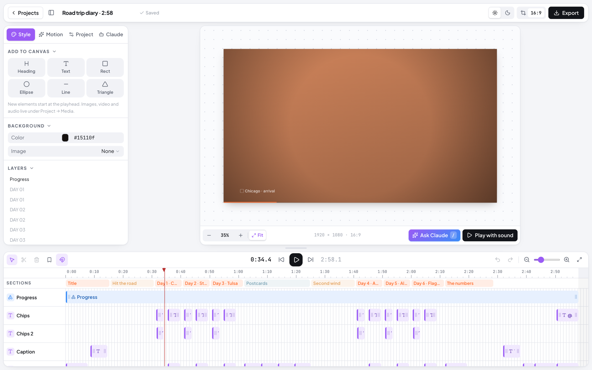
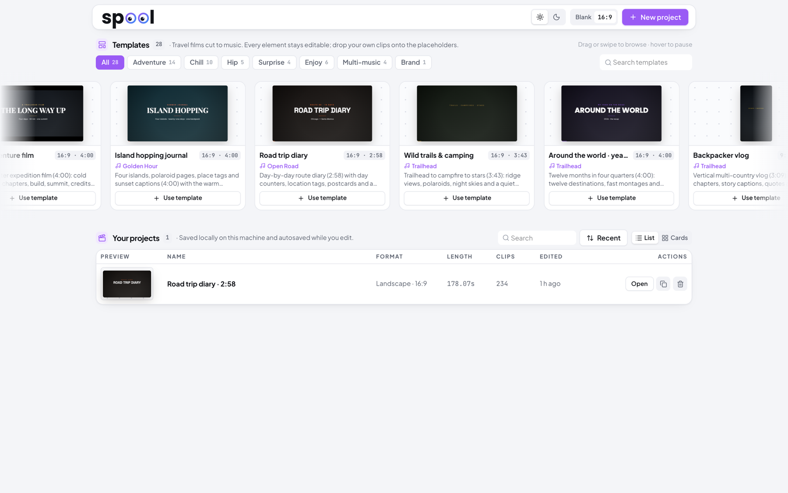
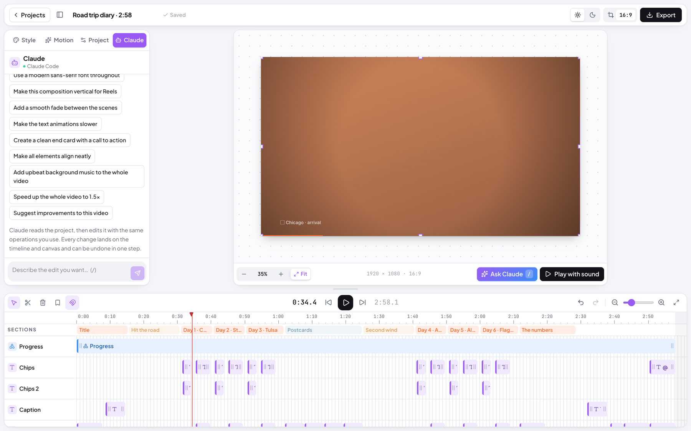
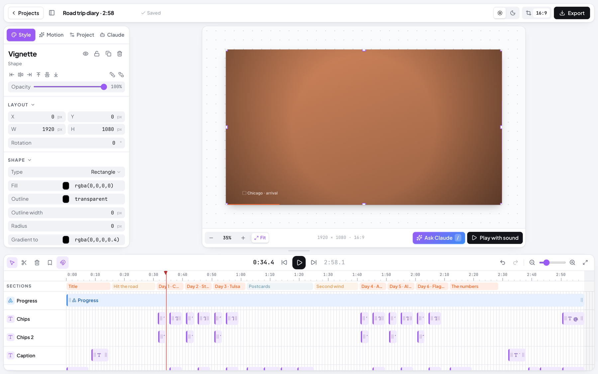
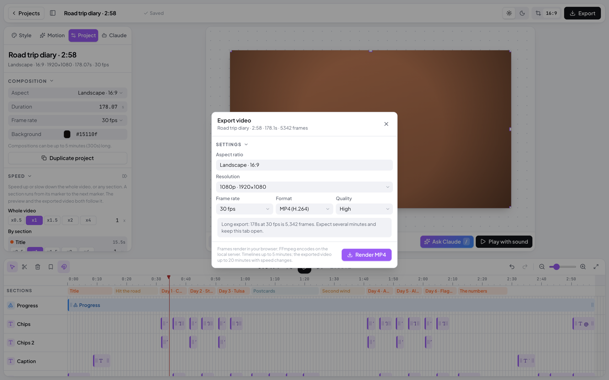
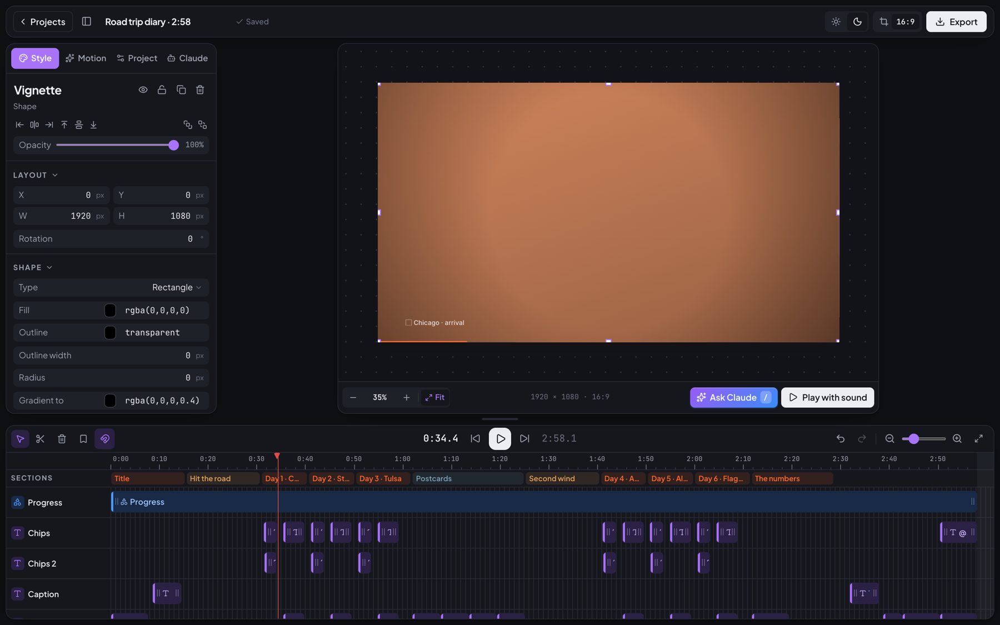

<h1 align="center">Spool</h1>

<p align="center">
  Video stories from your trips. A lightweight, browser-based video editor with Claude AI built in.
</p>

<p align="center">
  
  
  
  
  
  
</p>

<p align="center">
  
</p>

Spool puts a composition canvas, a multitrack timeline and an AI co-editor in one calm workspace.
Start from a template or a blank project, describe what you want to Claude or edit by hand, and export a real MP4 or WebM.
Every feature is free: no subscriptions, watermarks, credits or premium gates.

## Highlights

- **Start in seconds.** 28 bundled templates, from 4-minute travel films to 15-second social reels, all cut to music and fully editable.
- **Edit by talking.** Ask Claude to add a title, slow an animation or reframe for Reels. It uses the same operations as the UI, and one request is one undo step.
- **A real timeline.** Multiple tracks, trim, split, snapping, section markers, speed control and zoom, always visible under the canvas.
- **Direct manipulation.** Move, resize and rotate text, shapes, images and video on the canvas, with snapping, guides and inline text editing.
- **Motion built in.** Entrance and exit presets, keyframes, easings and transitions that follow the playhead exactly.
- **Honest export.** Frames render in your browser and FFmpeg mixes the audio and encodes the file. What you see is what you get.
- **Yours to keep.** Projects autosave locally, media stays on your machine, and there is no account to create.

## Start from a template

<p align="center">
  
</p>

Browse templates by mood (Adventure, Chill, Hip, Surprise, Enjoy, Multi-music, Brand) or search by name or song.
Each one is an ordinary project: placeholders are moving colour frames you replace by dragging your own clips in, and every template ships with a full-length music track.

## Edit with Claude

<p align="center">
  
</p>

Describe the result instead of configuring every property:

> "Create a clean end card with a call to action."
> "Make the text animations slower."
> "Add upbeat background music to the whole video."
> "Suggest improvements to this video."

Claude reads the project, applies validated edits to the real timeline and canvas, and lists what it changed with an **Undo changes** action.
Nothing is faked: without a Claude Code sign-in the panel says so and the rest of the editor keeps working.

## Style every element

<p align="center">
  
</p>

The side panel is contextual. Select a layer and it reveals only what applies: typography for text, fills and gradients for shapes, volume and fades for audio, plus alignment, order, lock and hide.

## Animate and time it

<p align="center">
  
</p>

Pick an entrance or exit preset, choose the transition from the previous clip, or add keyframes for position, scale, rotation and opacity at the playhead.

## Export to a real video

<p align="center">
  
</p>

Choose 1920×1080, 1080×1920, 1080×1080 and more, 24 to 60 fps, MP4 (H.264) or WebM (VP9), watch progress, cancel any time, and download the result.

## Light and dark

<p align="center">
  
</p>

## Also included

- Media library with drag-and-drop uploads, thumbnails, search, rename and delete
- A royalty-free music library with eight moods, previewable by section
- Undo and redo for every edit, manual or AI
- Keyboard shortcuts for playback, split, duplicate, nudge and save
- Duplicate, rename and reopen projects, with visible autosave status

## Get started

```bash
npm install
npm run dev
```

Then open <http://localhost:5173>. Configuration, the Claude connection, project layout, templates, the export pipeline and limitations are documented in **[SETUP.md](SETUP.md)**.

## Disclaimer

Spool is an independent project. Claude usage and any hosting or remote rendering are third-party costs outside the app's free-feature policy. "Claude" is a trademark of Anthropic, PBC.
